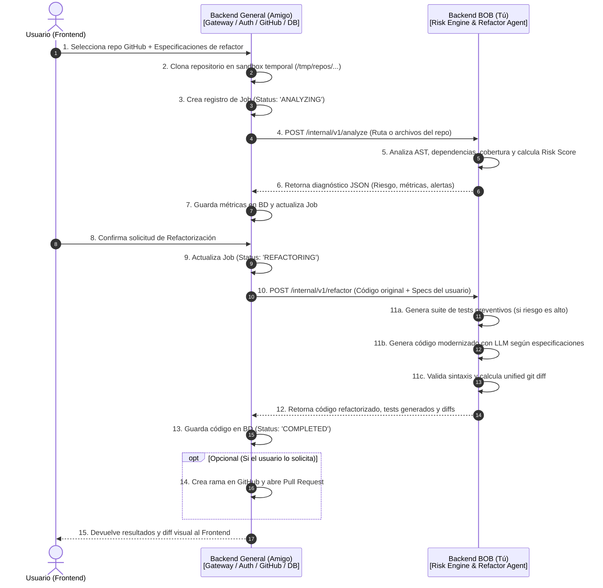
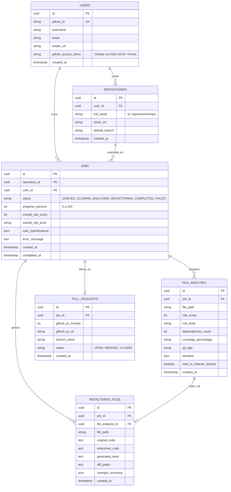

# 🤝 Guía de Coordinación e Integración — Backend General vs. Backend BOB (Alcy Legacy)

Este documento define el acuerdo de arquitectura, división de responsabilidades, contratos de API interna y el modelo de datos para coordinar el trabajo entre el **Backend General (Gateway / Orquestador)** y el **Backend BOB (Motor de Inteligencia & Refactorización)**.

---

## 🗺️ 1. Arquitectura y Topología de Servicios

El frontend **nunca** se comunica directamente con el Backend de BOB. Toda petición pública pasa primero por el Backend General, garantizando seguridad, control de sesiones y desacoplamiento.



---

## 📋 2. División Detallada de Tareas

### 🅰️ Lo que desarrollas TÚ (Backend BOB / AI Engine)
*Objetivo: Procesamiento estático, cálculo de riesgos, generación de pruebas preventivas y modernización de código con IA.*

- [ ] **1. Entrypoint FastAPI Interno:**
  - Configurar servidor FastAPI escuchando peticiones internas.
  - Implementar middleware de seguridad que valide el header `X-Internal-Secret`.
- [ ] **2. Motor de Análisis de Riesgo (`analyzer/`):**
  - **Escaner de Dependencias (`dependency_scanner.py`):** Analizar el AST del código para calcular módulos dependientes y grado de acoplamiento.
  - **Inspector de Cobertura (`coverage_checker.py`):** Buscar la presencia de pruebas unitarias existentes (`pytest`, `unittest`) asociadas a los archivos.
  - **Inspector de Git (`git_age.py`):** Evaluar historial de commits para medir antigüedad de la última edición (detección de código legacy estancado).
  - **Motor de Score (`risk_score.py`):** Algoritmo ponderado de riesgo (0 - 100) que califique en `low`, `medium` o `high`.
- [ ] **3. Generador de Red de Seguridad (Safety Harness):**
  - Generar automáticamente pruebas unitarias de caracterización cuando un archivo tenga riesgo alto (> 70), asegurando que la lógica no cambie antes de modernizar.
- [ ] **4. Motor de Refactorización con IA (`refactor/`):**
  - Integrar prompts especializados para el modelo LLM (IBM watsonx.ai, Granite, etc.) con:
    - Código fuente original.
    - Especificaciones provistas por el usuario (ej: *"Python 3.12, tipado PEP 484, async/await, decoradores"*).
    - Preservación estricta de las reglas de negocio originales.
- [ ] **5. Validador de Integridad y Generador de Diffs (`diff_generator.py`):**
  - Verificar que el código generado compile y no contenga errores de sintaxis (`ast.parse()`).
  - Generar el parche unificado estándar (`unified diff`) para que el frontend lo dibuje sin sobrecarga.

---

### 🅱️ Lo que desarrolla TU AMIGO (Backend General / Gateway)
*Objetivo: Autenticación, persistencia, clonado de repositorios, orquestación asíncrona de jobs y conexión con GitHub.*

- [ ] **1. Autenticación y Cuentas:**
  - Login mediante **GitHub OAuth**.
  - Almacenar el `github_access_token` del usuario de forma cifrada en la base de datos.
- [ ] **2. Manejo del Ciclo de Vida de Repositorios:**
  - Clonar el repositorio indicado por el usuario en un directorio temporal (`/tmp/repos/{job_id}`).
  - Limpiar el directorio temporal una vez finalizado el proceso.
- [ ] **3. Sistema de Tareas Asíncronas (Jobs/Workers):**
  - Dado que el análisis y refactorización toma tiempo (15 a 60 segundos), crear un sistema de tareas en segundo plano (`BackgroundTasks`, Celery o Redis).
  - Manejo de estados del job: `QUEUED` ➔ `ANALYZING` ➔ `REFACTORING` ➔ `COMPLETED` / `FAILED`.
- [ ] **4. Persistencia en Base de Datos:**
  - Crear e inicializar el esquema de tablas según el modelo ERD adjunto.
  - Almacenar los resultados de análisis y los códigos refactorizados devueltos por BOB.
- [ ] **5. Integración con GitHub (Pull Requests automáticos):**
  - Crear una rama (ej: `bob/refactor-modernization`) en el repo del usuario usando su token de GitHub.
  - Subir los commits con el código modernizado y abrir un Pull Request automático.
- [ ] **6. API Pública para el Frontend:**
  - Exponer endpoints seguros (JWT) para que React consulte el estado del repo, lance jobs y consulte el progreso mediante *polling* o WebSockets/SSE.

---

## 📡 3. Contrato de API Interna (Tú ⇄ Tu Amigo)

### Seguridad de la Red Interna
Todas las llamadas entre el Backend General y el Backend BOB deben incluir:
```http
X-Internal-Secret: <SECRET_DEFINIDO_EN_VARIABLES_DE_ENTORNO>
Content-Type: application/json
```

---

### Endpoint 1: Diagnóstico de Riesgo
**`POST /internal/v1/analyze`**

#### Payload de Solicitud (Backend General ➔ BOB):
```json
{
  "repoPath": "/tmp/repos/user_project_123",
  "targetFiles": [
    "scripts/legacy_module.py"
  ],
  "scope": "file"
}
```

#### Payload de Respuesta (BOB ➔ Backend General):
```json
{
  "success": true,
  "summary": {
    "overallRisk": 87,
    "riskLevel": "high",
    "totalFiles": 1,
    "highRiskFilesCount": 1
  },
  "files": [
    {
      "filePath": "scripts/legacy_module.py",
      "riskScore": 87,
      "riskLevel": "high",
      "dependencies": 14,
      "coverage": "12%",
      "age": "4.2 años",
      "blockers": [
        "Alto acoplamiento con 14 módulos críticos",
        "Sin tests unitarios automatizados detectados",
        "Uso de variables globales no resueltas"
      ],
      "safeToRefactorDirectly": false,
      "recommendation": "Generar suite de tests de caracterización antes de refactorizar."
    }
  ]
}
```

---

### Endpoint 2: Modernización y Refactorización
**`POST /internal/v1/refactor`**

#### Payload de Solicitud (Backend General ➔ BOB):
```json
{
  "filePath": "scripts/legacy_module.py",
  "originalCode": "def calculate_price(base_price, customer_type='regular'):\n    if customer_type == 'premium':\n        return round(base_price * 0.85, 2)\n    return round(base_price, 2)",
  "userSpecs": {
    "targetLanguage": "python",
    "targetVersion": "3.12",
    "framework": "standard",
    "customInstructions": "Agregar tipado estricto (PEP 484), dataclasses y docstrings Google-style."
  },
  "generateTests": true
}
```

#### Payload de Respuesta (BOB ➔ Backend General):
```json
{
  "success": true,
  "filePath": "scripts/legacy_module.py",
  "refactoredCode": "from typing import Literal\n\ndef calculate_price(base_price: float, customer_type: Literal['regular', 'premium'] = 'regular') -> float:\n    \"\"\"Calcula el precio final aplicando descuentos según el tipo de cliente.\"\"\"\n    if customer_type == 'premium':\n        return round(base_price * 0.85, 2)\n    return round(base_price, 2)\n",
  "generatedTests": "import pytest\nfrom legacy_module import calculate_price\n\ndef test_regular_customer():\n    assert calculate_price(100.0, 'regular') == 100.0\n\ndef test_premium_customer():\n    assert calculate_price(100.0, 'premium') == 85.0\n",
  "diff": "--- scripts/legacy_module.py (original)\n+++ scripts/legacy_module.py (modernizado)\n@@ -1,4 +1,7 @@\n+from typing import Literal\n+\n-def calculate_price(base_price, customer_type='regular'):\n+def calculate_price(base_price: float, customer_type: Literal['regular', 'premium'] = 'regular') -> float:\n",
  "changesSummary": [
    "Tipado estricto PEP 484 añadido",
    "Docstring descriptivo incorporado",
    "Generada suite de 2 tests en pytest"
  ]
}
```

---

## 🗄️ 4. Modelo de Base de Datos (Para el Backend General)

Tu compañero debe configurar la siguiente estructura relacional (PostgreSQL recomendado):



---

## 🎯 5. Fases de Coordinación y Plan de Entrega

| Fase | Tarea de Tu Amigo (Backend General) | Tu Tarea (Backend BOB) | Validación Conjunta |
| :---: | :--- | :--- | :--- |
| **1. Mocking** | Implementa rutas ficticias y define la base de datos. | Levanta servidor FastAPI con endpoints `/internal/v1/*` retornando JSONs estáticos. | Comprobar que el Backend General puede hacer peticiones HTTP al Backend BOB y recibir respuesta. |
| **2. Análisis** | Flujo de clonado de repos de GitHub a `/tmp` y llamada a `/analyze`. | Implementa el motor AST real y la fórmula de Risk Score en `backend/analyzer/`. | Probar con un repo de prueba y ver que el frontend reciba las métricas reales. |
| **3. Refactor** | Conectar frontend para enviar especificaciones y llamar a `/refactor`. | Conectar el prompt LLM, generador de tests y cálculo del diff unificado. | Verificar que el código generado compile y el diff se dibuje correctamente en la UI. |
| **4. Entrega** | Creación de Pull Request en GitHub con el token del usuario. | Afinar validación de sintaxis para evitar alucinaciones del modelo. | Demo completa end-to-end (Repo de GitHub ➔ Análisis ➔ Refactor ➔ PR abierto). |
